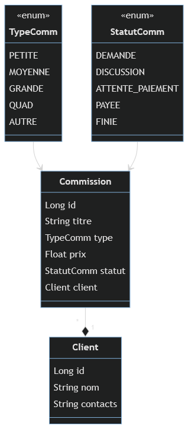
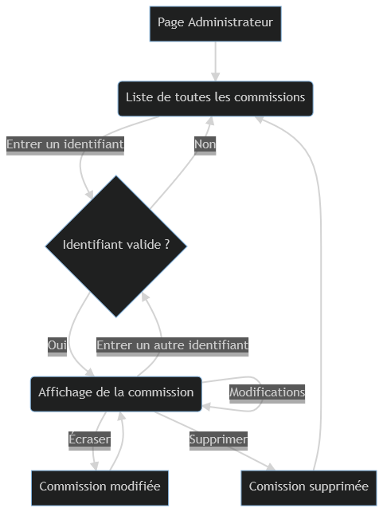
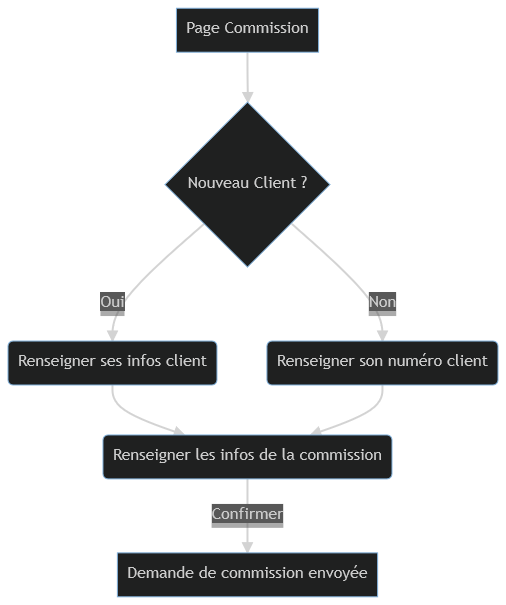

# crochet-website

Ce projet est un petit site web utilisant Spring Boot, jQuery, et hsqldb.

## Cahier des charges

- Application autonome avec Spring Boot
- Services REST (consommés depuis le js) respectant au maximum les normes
- Offrir du CRUD sur les ressources de la base de données
- Framework javascript (ici jQuery)
- Base de données composée de plusieurs entités, avec au moins une relation

## Site web

L'idée de ce projet est de concevoir le site web de Max, un artiste qui réalise des peluches et autres oeuvres en crochet. 

Il souhaite disposer d'un site qui puisse jouer le rôle de **vitrine** (profil, galerie de photos, liens vers des réseaux sociaux), mais qui doit également permettre à de potentiels clients de lui envoyer une demande de **commission** - c'est-à-dire une commande.

Pour cela, notre base de données va disposer de deux tables : 
- **Client**, dans laquelle on va enregistrer les clients potentiels, leur nom, leurs contacts, etc.
- **Commission**, dans laquelle on va enregistrer les demandes de commissions individuelles : type de commande, prix envisagé, etc.

On pourra définir une limite de demandes de commissions, au-delà de laquelle il ne sera plus possible d'en demander afin de ne pas submerger Max.

Chaque commission est liée à un unique client, mais un client peut avoir plusieurs commissions (en cours ou terminées).

## Base de données

### Schéma de la base de données

Les **clients** sont modélisés par un nom et des contacts, c'est-à-dire un ou plusieurs moyens de prendre contact avec eux.

Les **commissions** sont modélisées par un titre, un type, un prix (estimé ou final selon le statut), un statut, et un client.

Le type et le statut sont représentés par des énumérations :

### TypeComm

Correspond aux types de peluches qu'il est possible de commander, ce qui est expliqué plus en détail sur la page "Prix" du site.

- **PETITE, MOYENNE, GRANDE** : peluches de tailles variables
- **QUAD** : peluche quadrupède
- **AUTRE** : commission spéciale

### StatutComm

Correspond aux étapes du "cycle de vie" d'une commission :

- **DEMANDE** : Une demande de commission a été envoyée, mais n'a pas encore été évaluée par l'artiste
- **DISCUSSION** : L'artiste et le client sont en train de discuter des détails de la commission
- **ATTENTE_PAIEMENT** : Un prix a été fixé, et l'artiste est en attente d'un paiement
- **PAYEE** : Le prix convenu a été réglé par le client, et l'artiste travaille sur la commande
- **FINIE** : La commande a été livrée, cette commission est "archivée"

Les commissions et les clients sont liés par une relation **many to one** : 
chaque commission possède un unique client, mais les clients peuvent posséder plusieurs commissions.

## Fonctionnement global de l'application

Ce schéma résume toutes les fonctionnalités du site.

### Page Administrateur 

### Page Commission

## Difficultés rencontrées

La seule vraie difficulté rencontrée concernait la page de demande de commission,
qui doit créer un client et une commission en même temps dans le cas d'un nouveau client.

Les requêtes POST ont finalement été réalisées en utilisant la fonction générique `$.ajax()`, car les requêtes envoyées avec `$.post()` généraient des erreurs.

De plus, il a fallu s'assurer que le client était bien créé dans la base de données avant d'envoyer la requête de création de la commission, qui référençait ce client.